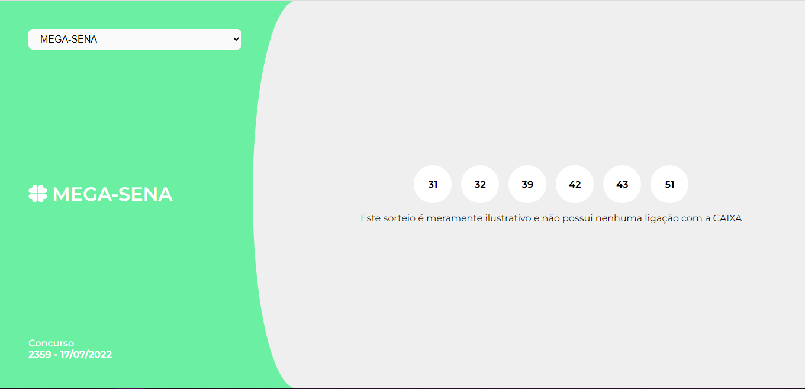

# Teste técnico da Brainn
Teste técnico feito para a Brainn Co

    

Esta aplicação exibe os resultados de concursos fictícios das Loterias Caixa aqui do Brasil. Nela você terá a oportunidade de navegar entre os resultados e ter uma resposta visual das mudanças.
Todos os dados vem de uma API hospedada pelo Heroku da própria Brainn Co, apenas fiz a consultas aos _endpoints_.

Neste desafio pude demonstrar habilidades com as tecnologias adotadas, além de abordar boas práticas de programação, testes unitários, configurações de estilização e muito mais. Também decidi seguir uma convenção para melhorar a mensagem dos commits, seguindo a especificação dos [Conventional Comiits](https://www.conventionalcommits.org/en/v1.0.0/), o que permitiu adicionar mensagens semânticas e legíveis para a leitura humana e de máquina.

Você pode acompanhar a descrição deste desafio a partir [deste README](https://github.com/brainnco-exs/readme-frontend) disponibilizado pela [Brainn Co](https://brainn.co/).

Para fazer o deploy eu usei o serviço gratuito no Netlify e você pode ver o resultado a partir [deste link](https://resultadosdeloteriabrainn.netlify.app/).
